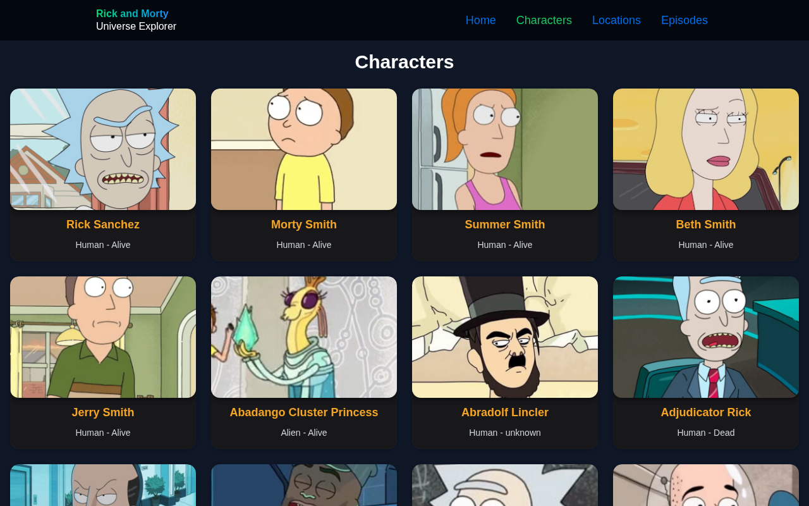
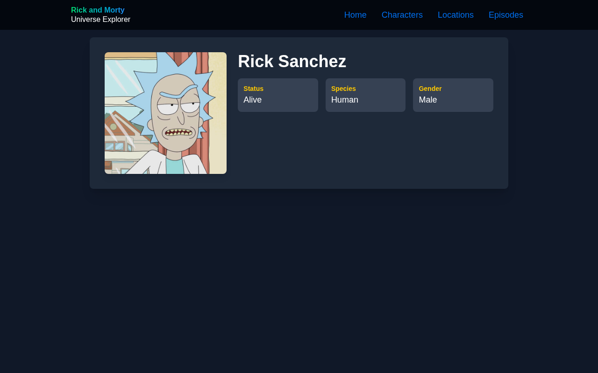
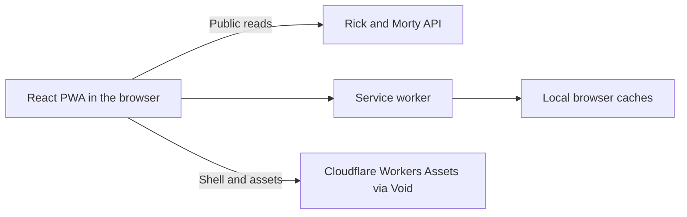

# Rick and Morty Platform

[](https://viteplus.dev/)
[](https://developers.cloudflare.com/workers/)
[](https://devenv.sh)
[](LICENSE)

Browse Rick and Morty characters, locations, and episodes in an installable web app.
Rick and Morty Viewer supports public browsing, client-side navigation, and offline access to previously loaded content.
This repository maintains the application, its development environment, tests, and release pipeline.

[Open the live application](https://rick-and-morty-platform.kvazzie.workers.dev/) ·
[Releases](https://github.com/kvazzie/rick-and-morty-platform/releases) ·
[Contributing](CONTRIBUTING.md) · [Roadmap](ROADMAP.md)

## Screenshots

Captured from the live 1.0.0 application. Click an image to view it at full size.

| Character browsing                                                                                                    | Character details                                                                                                                                      |
| --------------------------------------------------------------------------------------------------------------------- | ------------------------------------------------------------------------------------------------------------------------------------------------------ |
| [](docs/screenshots/characters.png) | [](docs/screenshots/character-detail.png) |

See [screenshot capture notes](docs/screenshots/README.md) for the source and refresh procedure.

## Product and PWA behavior

Visitors can browse characters, locations, and episodes without an account. List and detail routes use client-side
navigation. Requests show loading indicators and visible failure messages, including when an additional page cannot load.
The application has no login or signup flow and does not use local storage for authentication.

After an online visit finishes installing the service worker, the application shell and route code can start offline.
Previously requested public API pages, details, and character images remain available from the local cache.
Uncached content shows an explicit offline message, and an unavailable next page keeps the visible characters.
When the browser reconnects, the current page retries its requests and refreshes the cached data.

When a new service worker is ready, an update prompt lets you choose when to reload. `Update now` activates the
waiting worker and reloads the current address, preserving its route, query, pagination hash, and browser history.
`Later` keeps the current session running and leaves an `Update available` button to reopen the prompt. Accepting in
another tab activates the shared worker, but this tab waits for its own consent before reloading. A new worker
does not automatically take over open tabs. Closing all tabs can allow a waiting worker to activate through the
browser's normal service-worker lifecycle.

The installable app is named Rick and Morty Viewer. Its standalone manifest uses the application's dark theme,
a root-scoped start address and stable ID, generated 192- and 512-pixel standard icons, and a separate 512-pixel
maskable icon. The PWA asset generator also supplies favicon and Apple touch links in the production HTML.

Public, credential-free GET requests to the character, location, and episode endpoints use network-first caching,
including numbered pages. Only successful JSON responses are stored. Mutations, authenticated requests, unknown
endpoints or query parameters, and responses marked private or no-store bypass this policy. API data is limited to
100 cached responses and character images to 200, with a 30-day expiry. Browser storage eviction can also remove them.

## Architecture

The shipped 1.0.0 application is a client-rendered React SPA in a TypeScript monorepo.
Only `apps/web` exists today. Workspace manifests are private to prevent npm publication.



- React 19.3, React Compiler, and React View Transitions render the UI. HeroUI and Tailwind CSS provide components and styling.
- React Router owns the home, category, and detail routes. Lists load incrementally; the URL hash records pagination for restoration.
- The application API module reads the [Rick and Morty API](https://rickandmortyapi.com/documentation) directly. Request hooks and route boundaries handle loading, failures, and reconnect retries.
- `vite-plugin-pwa` generates the service worker and installation metadata. Workbox handles shell precaching and the runtime cache policies described above.
- Void deploys the static build to Cloudflare Workers Assets with a small SPA routing Worker. There is no application server or database in 1.0.0.

```text
apps/web/            React PWA, Storybook, and production browser tests
docs/development/    Component, CI, branch, release, and deployment guidance
devenv.nix           Developer shell tooling, tasks, and processes
flake.nix            Devenv integration, pinned by flake.lock
vite.config.ts       Repository formatting, linting, types, and staged checks
```

New applications and shared packages belong in the repository only when a product requirement needs them.
The planned Telegram and MCP applications and the post-1.0 TanStack Start migration are documented in [ROADMAP.md](ROADMAP.md).

## Development

Install [Nix](https://nixos.org/download/) with the `nix-command` and `flakes` experimental features enabled.
From the repository root, enter the pinned [Devenv](https://devenv.sh/guides/using-with-flakes/) shell:

```sh
nix develop --impure
```

Devenv needs `--impure` to discover the working directory. `flake.lock` pins the environment inputs, and
`devenv.nix` defines the shell. With [nix-direnv](https://github.com/nix-community/nix-direnv) installed,
`direnv allow` loads the same shell through `.envrc`.

The flake declares Devenv's public binary cache. To accept those cache settings noninteractively, use
`nix develop --accept-flake-config --impure`.

The shell supplies TypeScript/JavaScript, HTML/CSS/JSON, Tailwind CSS, YAML, Nix, and shell language servers,
plus TypeScript, Nix formatting, and ShellCheck. The Helix configuration uses `vp lint` and `vp fmt`
after dependency installation. The shell keeps the global `vp` ahead of project binaries so that
`vp env` remains available. Vite+ supplies the project runtime and package manager. If `vp` is
missing, shell startup prints the [official installation recommendation](https://viteplus.dev/guide/):

```sh
curl -fsSL https://vite.plus | bash
```

Open a new shell after installation. Follow the
[live Nixpkgs Vite+ packaging search](https://github.com/NixOS/nixpkgs/issues?q=%22vite%2B%22)
for native packaging progress.

Vite+ selects Node 24 from `.node-version` and the pinned `pnpm@10.29.3` from `package.json`.
Void requires Node 24.21.0 or later in the 24.x line. Enable Vite+'s environment management,
then install dependencies and run commands from the repository root:

```sh
vp env on
vp env current
vp install --frozen-lockfile
vp run dev
```

The development server prints its local address. Use `vp env current` to confirm the selected runtime and package manager.
Before browser tests, install the pinned Chromium:

```sh
vp env exec --node 24 --package-manager pnpm@10.29.3 vp exec --filter @rick-and-morty-platform/web playwright install chromium
```

On supported Linux systems missing browser libraries, use the same command with `install --with-deps chromium`.

The root provides `build`, `check`, `lint`, `typecheck`, `fmt`, `fmt:check`, `test`, `preview`, and
`generate-pwa-assets` commands through `vp run <name>`. Application commands select the web workspace,
so contributors do not need to change directories.

Use `vp run storybook` for the component workshop and `vp run storybook:build` for its static build.
Inside the shell, `devenv up` starts the development server, and `devenv tasks run platform:build` runs
the workspace build task. Entering the shell does not install dependencies or run project checks.

Components, pages, and providers follow [the component directory and export conventions](docs/development/components.md).

## Validation

Run checks from the repository root after installing dependencies and Chromium:

```sh
vp env exec --node 24 --package-manager pnpm@10.29.3 -- vp check
vp run test
vp run test:coverage
```

`vp check` checks formatting, type-aware linting with warnings denied, and types. The explicit runtime selection also
works when Vite+ is in system-first mode. For types alone, use the same command with `--no-fmt --no-lint`.
The full test command runs unit and integration tests, Storybook browser assertions, native Devenv shell tests,
and production PWA E2E tests with an uncached build. Coverage reports cover the application tests.

Use `vp run test:unit`, `vp run test:integration`, `vp run test:storybook`, or `vp run test:e2e` for focused feedback.
[TESTING.md](TESTING.md) defines the behavioral boundaries, file-specific commands, and coverage reports.

GitHub Actions validates checked pull requests to `dev` and `main`, pushes to `main`, and manual runs.
Its required **Quality gate** builds once and tests that artifact in Chromium after application and environment checks pass.
See [CI operation](docs/development/ci.md) for artifact identity, diagnostics, and weekly dependency updates.

## React runtime

React and React DOM use the same exact stable release, `19.3.0`, with matching stable
TypeScript declarations. Upgrade the runtime packages together.

React Compiler runs in the application and Storybook through plugin-react 6.1's native Oxc
integration and `oxc-transform-react`, with `target: '19'` and `panicThreshold: 'all_errors'`.
Compilation diagnostics fail the build. This compiler integration is experimental and uses no
Babel compiler plugin. Type-aware `vp lint` and `vp check` run Oxlint's native recommended compiler
diagnostics, including `react/unsupported-syntax`, plus the hooks and effect-dependency rules as
errors. Oxc does not implement the upstream `config` and `gating` lint rules because its lint
compiler options are fixed and it does not expose gating.

React Router retains the existing routes and navigation behavior. React View Transitions wrap
route content and asynchronous list content, and character images keep matching names between
their cards and detail pages. Pagination updates use `startTransition`. The CSS
`prefers-reduced-motion: reduce` override removes View Transition animations while keeping the same
navigation and content. Browsers without the View Transition API render the same content normally.

## Tasks and hooks

`.editorconfig` owns indentation, line endings, final newlines, and line width. The root `vite.config.ts`
keeps formatter settings that EditorConfig cannot express for Oxfmt, plus linting, type-check options,
and staged checks. Oxfmt does not read `quote_type`, so `fmt.singleQuote` preserves single quotes.
The web lint override uses the built-in browser environment for its globals. Workspace configs own
their application builds. `vp run build` selects workspace build tasks, which build their
workspace dependencies first. Tasks declared in `run.tasks` use Vite+'s cache by default. Repeated builds
reuse outputs when their inputs match, including restoring deleted build output. Use
`vp run --no-cache build` to force a build and `vp run --last-details` to inspect task and cache results.

Installation runs `vp config --hooks-dir .vite-hooks --no-agent` to set up Vite+'s Git hook dispatcher. The committed
`.vite-hooks/pre-commit` runs `vp staged`, and `.vite-hooks/commit-msg` invokes the local Commitlint
configuration through `vp exec`. Generated dispatcher files stay untracked. Check hook state with
`vp hooks status`; `vp hooks disable` and `vp hooks enable` change it for this clone.

If an existing clone still points to `.husky/_`, switch its dispatcher once:

```sh
vp hooks disable
vp hooks enable --hooks-dir .vite-hooks
```

Hooks provide local feedback. Full checks run directly through the project commands regardless of hook state.
Both `dev` and `main` require checked pull requests and the Quality gate, with no bypass actors.
See [the clean-checkout validation sequence](TESTING.md#baseline-validation) to reproduce all checks without relying on hooks.

## Releases

Changesets records explicit release notes and version bumps with `vp run changeset`.
The private workspace group shares one version. The root `package.json` and `CHANGELOG.md`
follow the current web workspace, keeping one repository release train.

A checked version PR lands on `dev` before a short-lived promotion PR brings `dev`
into `main`. After the promoted commit passes CI, automation creates its `v<version>`
tag and GitHub release. Every workspace stays private, and no workflow publishes to npm.
See [release operation](docs/development/releases.md) for dry runs and branch requirements.

After release, CI deploys the validated browser artifact through Void as a static
SPA and checks the public character-browsing flow. It downloads the artifact from the same successful workflow run,
deploys it without rebuilding, and checks that the live HTML, service worker, and manifest match it. See
[deployment setup](docs/development/deployment.md) for Cloudflare account setup,
`CLOUDFLARE_API_TOKEN`, account variables, and the live smoke-check command.

## Contributing and commits

Start a `feature/*` branch from `dev` and open the pull request against `dev`.
Run the validation commands above, describe the resulting behavior, and include a Changeset when a change needs a release.
Feature pull requests use rebase merging to preserve their commits; promotion from `dev` to `main` uses a merge commit.

Write [Conventional Commits](https://www.conventionalcommits.org/en/v1.0.0/), such as
`feat(web): add episode browsing`, `fix(web): retry details on reconnect`, or `docs: refresh showcase screenshots`.
Commitlint checks the message through the optional Vite+ hook. Changesets determine versions and release notes independently.
See [CONTRIBUTING.md](CONTRIBUTING.md) for the contribution checklist and project conventions.

## License and credits

The repository's code and documentation are available under the [MIT license](LICENSE).
You may use, copy, modify, distribute, sublicense, and sell them, including in commercial projects, while retaining
the copyright and permission notice in copies or substantial portions. The software is provided without warranty.

Character data and images come from the [Rick and Morty API](https://rickandmortyapi.com/).
Rick and Morty names, characters, artwork, and other third-party material remain the property of their respective owners;
the repository license does not grant rights to those materials.
